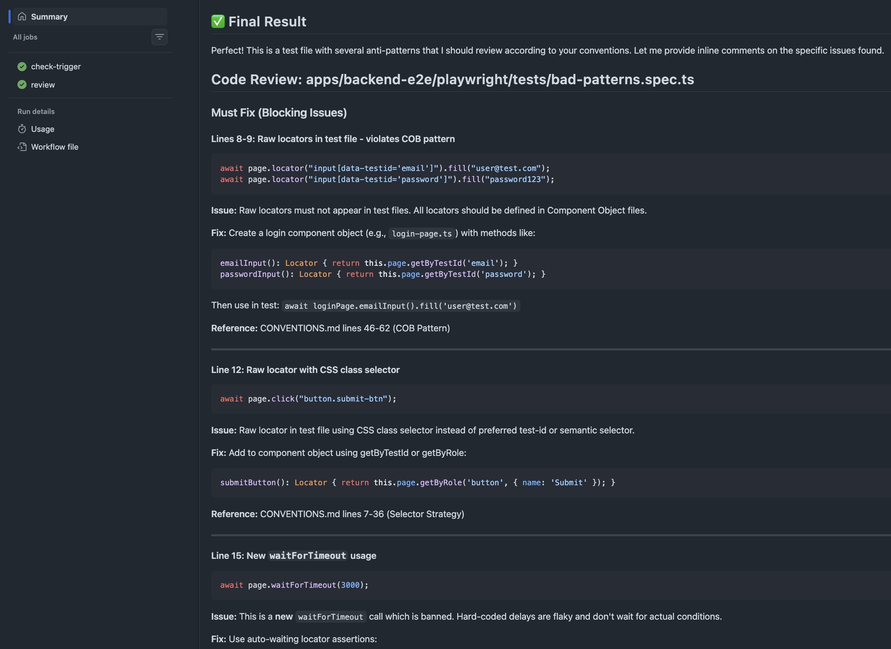
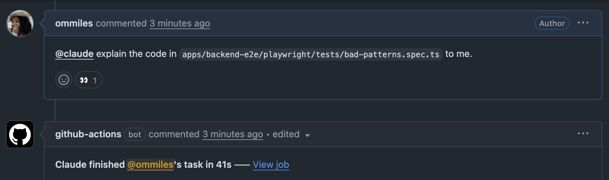
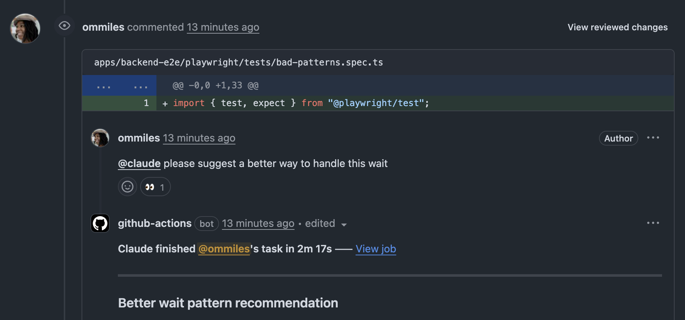

# Playwright Code Review Agent

AI-powered code review for Playwright test changes using Claude.

Automatically reviews PRs against our CONVENTIONS.md:



Ask Claude questions directly in PR comments:



Get context-aware suggestions on specific code lines:



---

## Triggers

### Automatic
| Trigger | When | What's Checked |
|---------|------|----------------|
| PR Opened | New PR with Playwright file changes | Full PR diff |
| New Commits | Push to existing PR | Only the new commits |

### Manual
| Trigger | How | What's Checked |
|---------|-----|----------------|
| Checkbox | Check `[x] Run Playwright Code Review` in PR description | Full PR diff |
| @claude mention | Comment `@claude <your request>` | Context-aware response |

---

## Setup

### 1. Add the workflow file

Copy `.github/workflows/playwright-code-review.yml` to your repository.

### 2. Add the API key secret

Add `ANTHROPIC_API_KEY` to your repository secrets:
- Go to Settings → Secrets and variables → Actions
- Click "New repository secret"
- Name: `ANTHROPIC_API_KEY`
- Value: Your Anthropic API key

### 3. Configure workflow permissions

Go to Settings → Actions → General → Workflow permissions:
- Select "Read and write permissions"
- Check "Allow GitHub Actions to create and approve pull requests"

### 4. (Optional) Add PR template

Copy `.github/pull_request_template.md` to enable the manual re-run checkbox.

---

## Configuration

### Bot Identity
- **Name**: `playwright-reviewer`
- Distinguishes this agent from other Claude bots in our organization

### Authentication
Uses `secrets.GITHUB_TOKEN` (not OIDC) for simplicity.

### Path Filtering
Only triggers on changes to:
```
apps/backend-e2e/playwright/**
```
Excludes: `README.md`, `CONVENTIONS.md`

**To customize:** Edit the `paths` section in the workflow file.

### Max Turns
Scales dynamically with file count to handle large PRs without hitting limits.

### Incremental Checking
On subsequent pushes, only checks new commits (not the full PR) to save API costs.

---

## Workflow File

<details>
<summary>Click to expand full workflow</summary>

```yaml
name: Playwright Code Review Agent

on:
  # Auto-trigger when Playwright files change
  pull_request:
    types: [opened, synchronize]
    paths:
      - 'apps/backend-e2e/playwright/**'
      - '!apps/backend-e2e/playwright/README.md'
      - '!apps/backend-e2e/playwright/CONVENTIONS.md'

  # Manual re-run via checkbox (edited = checkbox state change)
  pull_request_target:
    types: [edited]

  # Allow @claude mentions for follow-up requests
  issue_comment:
    types: [created]
  pull_request_review_comment:
    types: [created]

jobs:
  check-trigger:
    runs-on: ubuntu-latest
    outputs:
      should_run: ${{ steps.determine.outputs.should_run }}
    steps:
      - name: Determine if review should run
        id: determine
        env:
          PR_BODY: ${{ github.event.pull_request.body }}
          EVENT_NAME: ${{ github.event_name }}
        run: |
          if [[ "$EVENT_NAME" == "pull_request" ]]; then
            echo "should_run=true" >> $GITHUB_OUTPUT
            exit 0
          fi
          if [[ "$EVENT_NAME" == "issue_comment" || "$EVENT_NAME" == "pull_request_review_comment" ]]; then
            echo "should_run=true" >> $GITHUB_OUTPUT
            exit 0
          fi
          if [[ "$EVENT_NAME" == "pull_request_target" ]]; then
            if echo "$PR_BODY" | grep -qiE '\[x\]\s*Run Playwright Code Review'; then
              echo "should_run=true" >> $GITHUB_OUTPUT
            else
              echo "should_run=false" >> $GITHUB_OUTPUT
            fi
            exit 0
          fi
          echo "should_run=false" >> $GITHUB_OUTPUT

  review:
    needs: check-trigger
    if: needs.check-trigger.outputs.should_run == 'true'
    runs-on: ubuntu-latest
    permissions:
      contents: read
      pull-requests: write
      issues: write

    steps:
      - name: Checkout code
        uses: actions/checkout@v4
        with:
          fetch-depth: 0
          ref: ${{ github.event.pull_request.head.sha }}

      - name: Get changed Playwright files
        id: changed-files
        if: github.event_name == 'pull_request' || github.event_name == 'pull_request_target'
        env:
          EVENT_ACTION: ${{ github.event.action }}
          BASE_SHA: ${{ github.event.pull_request.base.sha }}
          HEAD_SHA: ${{ github.event.pull_request.head.sha }}
          BEFORE_SHA: ${{ github.event.before }}
        run: |
          if [[ "$EVENT_ACTION" == "synchronize" && -n "$BEFORE_SHA" ]]; then
            FILES=$(git diff --name-only "$BEFORE_SHA" "$HEAD_SHA" \
              | grep 'apps/backend-e2e/playwright/' \
              | grep -v 'README.md' \
              | grep -v 'CONVENTIONS.md' \
              | tr '\n' ' ')
          else
            FILES=$(git diff --name-only "$BASE_SHA" "$HEAD_SHA" \
              | grep 'apps/backend-e2e/playwright/' \
              | grep -v 'README.md' \
              | grep -v 'CONVENTIONS.md' \
              | tr '\n' ' ')
          fi
          echo "files=$FILES" >> $GITHUB_OUTPUT
          FILE_COUNT=$(echo "$FILES" | wc -w | tr -d ' ')
          echo "file_count=$FILE_COUNT" >> $GITHUB_OUTPUT
          if [ "$FILE_COUNT" -gt 0 ]; then
            MAX_TURNS=$(( ((FILE_COUNT - 1) / 10 + 1) * 10 ))
            if [ $MAX_TURNS -gt 50 ]; then MAX_TURNS=50; fi
            echo "max_turns=$MAX_TURNS" >> $GITHUB_OUTPUT
          else
            echo "max_turns=10" >> $GITHUB_OUTPUT
          fi

      - name: Run Claude Code Review
        if: |
          github.event_name == 'issue_comment' ||
          github.event_name == 'pull_request_review_comment' ||
          steps.changed-files.outputs.file_count > 0
        uses: anthropics/claude-code-action@v1
        with:
          anthropic_api_key: ${{ secrets.ANTHROPIC_API_KEY }}
          github_token: ${{ secrets.GITHUB_TOKEN }}
          bot_name: "playwright-reviewer"
          prompt: "${{ (github.event_name == 'pull_request' || github.event_name == 'pull_request_target') && 'Review the Playwright test changes. Focus on our CONVENTIONS.md standards including: COB pattern compliance, selector strategy, auto-waiting assertions, and code reuse. Provide inline comments on specific issues.' || '' }}"
          claude_args: "--max-turns ${{ steps.changed-files.outputs.max_turns || '10' }}"

      - name: Skip (no Playwright changes)
        if: |
          (github.event_name == 'pull_request' || github.event_name == 'pull_request_target') &&
          steps.changed-files.outputs.file_count == 0
        run: echo "No Playwright files changed, skipping review"
```

</details>

---

## Known Limitations

### Verbose Job Summary
The GitHub Actions job summary includes detailed reasoning, tool calls, and token usage. This is standard behavior of the `claude-code-action` with no current way to disable it. The actual PR comments are concise - the verbose output is only visible in the Actions logs.

---

## Troubleshooting

### Review runs on every push, even non-Playwright changes
This shouldn't happen with the current workflow. Check that the `paths` filter is configured correctly.

### "error_max_turns" in review output
The review hit the turn limit. For very large PRs, consider breaking them into smaller changes.
